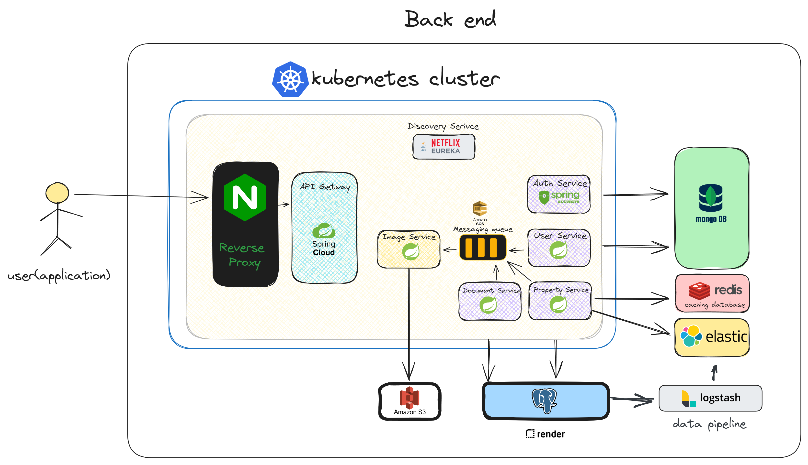

# Aqarati-Backend

------- 

> for notice i am still implementing a way to send the image to the SQS , i have worked in a way to take an image and devid it into chunk and send it to the sqs
-------

